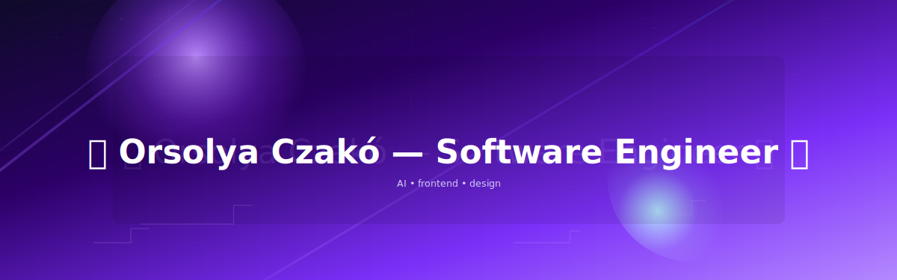

---

## Skills

## About

I design and build reliable, maintainable systems and clean user experiences. My focus is on backend architecture, API design and performance, while contributing to frontend and deployment automation where it delivers value.

---

## Featured Projects

| Project | Description | Tech Stack | Links |
| :--- | :--- | :--- | :---: |
| **[movie_recommender]** | **AI-powered movie recommender.** Chat with main characters or an AI film expert to get personalized recommendations via the Gemini API. |     |  |
| **[season_analysis]** | **Under development.** Facial analysis for seasonal color typing. Uses custom-trained models, image processing, and the Gemini API. |      |  |
| **[pdf_analyser]** | Analyzes PDF documents (scanned or digital) to extract nutritional value data using OCR and visual processing. |     |  |

---

## Contact

Personal site: COMING SOON

